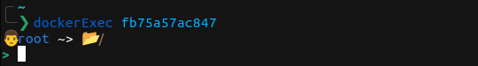

# Docker exec

Docker exec allows you to open a bash session inside a running container and have a nice bash prompt.

Essentially transforming this:\


To this:\


## Installation

### Go install
If you have golang locally, you can install it via go:
```bash
go install github.com/ntavelis/dockerExec/cmd/dockerExec@latest
```
### Latest binary
[Download the latest binary from here](https://github.com/ntavelis/dockerExec/releases/latest), it contains a pre-compiled the gzipped binary.

For instance for, VERSION=v1.0.0 and BINARY=dockerExec_Linux_x86_64
```bash
wget https://github.com/ntavelis/dockerExec/releases/download/${VERSION}/${BINARY}.tar.gz -O - |\
  tar xz && sudo mv dockerExec /usr/bin/dockerExec && rm README.md
```