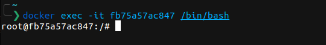
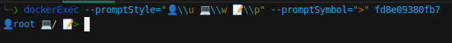
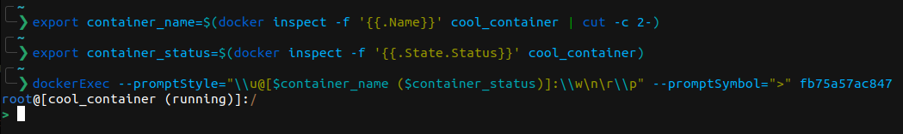

# Docker exec

## Intro
dockerExec is a CLI tool written in Go that provides an enhanced alternative to docker exec -it <container_id> /bin/bash. It opens a bash session inside a specified Docker container with a customizable and user-friendly prompt.

Essentially transforming this:\


To this:\


## Installation

### Go install
If you have golang locally, you can install it via go:
```bash
go install github.com/ntavelis/dockerExec/cmd/dockerExec@latest
```
### Latest binary
[Download the latest binary from here](https://github.com/ntavelis/dockerExec/releases/latest), it contains a pre-compiled gzipped binary.

For instance for, VERSION=v1.0.0 and BINARY=dockerExec_Linux_x86_64
```bash
wget https://github.com/ntavelis/dockerExec/releases/download/${VERSION}/${BINARY}.tar.gz -O - |\
  tar xz && mv dockerExec /usr/bin/dockerExec && rm README.md
```

## Usage

### Basic Usage
To open a bash session inside a Docker container with the default prompt style:

```bash
dockerExec <containerID>
```

### Full usage with flags
You can customize the shell, user, prompt style, and prompt symbol using flags:
```bash
dockerExec --shell=/bin/bash --user=root --promptStyle="\\u@\\w:\\p" --promptSymbol="$" <containerID>
```

### Flags

* --shell: Specify the shell to use (default: /bin/bash)
* --user: Specify the user to run the shell as (default: current user)
* --promptStyle: Customize the prompt style (default: "👨\\\u ~> 📂\\\w\r\n\\\p")
* --promptSymbol: Customize the prompt symbol (default: ">")
* --help(-h): Display the help message
* --version(-v): Display version information

## Customizing the Prompt

### Prompt Style (--promptStyle)

The --promptStyle flag allows you to customize the appearance of your bash prompt. The following placeholders are supported:

* \\\u: Replaced with the current user
* \\\w: Replaced with the current working directory
* \\\p: Replaced with the prompt symbol (passed with the --promptSymbol flag)

Note: Special chars \n \r \t are supported currently and can be used to promptStyle flag

#### Example

If you want your prompt to display the user and the working directory followed by the prompt symbol, you can set it like this:

```bash
dockerExec --promptStyle="\\u@\\w:\\p" <containerID>
```

### Prompt Symbol (--promptSymbol)

The --promptSymbol flag allows you to define a custom symbol to be used at the end of the prompt. This symbol will replace the \\p placeholder in the --promptStyle flag.

#### Example

```bash
dockerExec --promptSymbol="$" <containerID>
```

## Examples of custom prompts to get inspired

The below commands will customize the prompt, you can add them as alias in your terminal to easily use custom prompt in docker containers.

### Example 1: User at Hostname

```bash
dockerExec --promptStyle="\\u@\\w:\\p" --promptSymbol="\$" <containerID>
```


### Example 2: Minimal Prompt

```bash
dockerExec --promptStyle="\\w \\p" --promptSymbol=">" <containerID>
```


### Example 3: Emoji Prompt

```bash
dockerExec --promptStyle="👤\\u 💻\\w 📝\\p" --promptSymbol=">" <containerID>
```



### Example 4: Multiline Prompt

```bash
dockerExec --promptStyle="\\u@\\w\n\r\\p" --promptSymbol="\$" <containerID>
```


### Example 5: Prompt with container info

```bash
export container_name=$(docker inspect -f '{{.Name}}' cool_container | cut -c 2-)
export container_status=$(docker inspect -f '{{.State.Status}}' cool_container)
dockerExec --promptStyle="\\u@[$container_name ($container_status)]:\\w\n\r\\p" --promptSymbol=">" <containerID>
```

